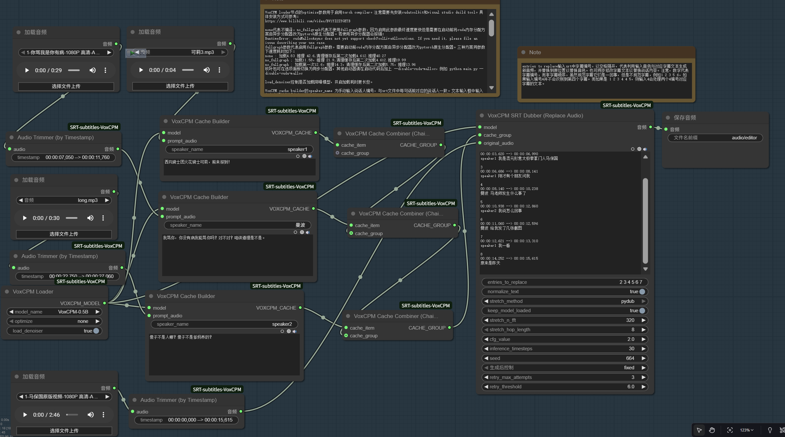

# ComfyUI-SRTVoxCPM

基于 [VoxCPM](https://github.com/OpenBMB/VoxCPM) 的 ComfyUI 节点，用于通过 SRT 字幕文件生成和编辑语音。

## [English Readme](README.md)

## 使用说明

### 节点介绍

#### 1. VoxCPM Loader
- **功能**: 加载 VoxCPM TTS 模型。
- **参数**:
  - `model_name`: 选择要加载的模型。默认选项 `openbmb/VoxCPM-0.5B (Auto-Download)` 会自动从 Hugging Face 下载模型。
  - `optimize`: 启用 `torch.compile` 以进行优化。此功能在 Windows 上因一些bug无法直接使用，也许可被社区修复，故保留该选项。

#### 2. VoxCPM Cache Builder
- **功能**: 为指定的说话人创建声音特征缓存（voiceprint）。
- **参数**:
  - `speaker_name`: 手动输入说话人的唯一标识符（例如 `speaker1`）。此名称需要与 SRT 字幕文件中对应文本行的说话人前缀完全一致。
  - `prompt_audio`: 输入参考音频。可使用 ComfyUI 内置的 `Load Audio` 节点加载，或通过 `Audio Trimmer` 节点截取长音频的特定片段。
  - `prompt_text`: 输入参考音频中对应的文本内容。

#### 3. VoxCPM Cache Combiner (Chainable)
- **功能**: 将多个说话人的声音特征缓存组合在一起，以支持多角色对话。
- **使用方法**:
  - 此节点可以像面条一样不断串联，每一个节点添加一个说话人。
  - 第一个 `Cache Combiner` 节点的 `cache_group` 输入端无需连接。
  - 后续节点的 `cache_group` 输入端应连接到前一个 `Cache Combiner` 节点的输出端。
  - 最后一个节点的输出连接到 `SRT Processor` 或 `SRT Dubber` 节点的 `cache_group` 输入端。

#### 4. Audio Trimmer (by Timestamp)
- **功能**: 根据时间戳精确截取音频片段。
- **参数**:
  - `timestamp`: 输入形如 `00:00:06,500 --> 00:00:08,000` 的时间戳文本，节点将仅输出此时间段内的音频。

#### 5. VoxCPM SRT Processor (from Scratch)
- **功能**: 根据 SRT 字幕和声音特征缓存从头开始生成完整的对话音频。
- **SRT 字幕格式**:
  - **多说话人模式**: SRT 文件中的每一句台词前，请使用 `说话人ID + 空格` 的格式来区分角色。例如：
    ```srt
    1
    00:00:00,500 --> 00:00:05,000
    speaker1 Hello world！

    2
    00:00:06,500 --> 00:00:08,000
    说话人 你好，世界！
    ```
  - **单说话人模式**: 当只有一个说话人时，字幕文本前无需添加任何前缀。例如：
    ```srt
    1
    00:00:00,500 --> 00:00:05,000
    Hello world！
    ```

#### 6. VoxCPM SRT Dubber (Replace Audio)
- **功能**: 替换现有音频文件中特定字幕片段的语音。可用于修正发音、更改台词或替换整个角色的声音。
- **参数**:
  - `entries_to_replace`: 输入 SRT 文件中需要替换的**字幕编号**，以空格隔开（例如 `1 3 5`）。节点会利用输入的音色和对应编号的字幕文本生成新音频，并替换到原始音频的相应时间位置。
  - **注意**: 这里输入的是字幕的**编号**，而非其在文件中的顺序。例如，对于编号为 `1 2 3 5 6` 的不规范字幕，输入 `4` 将不会匹配任何内容。如果字幕编号有重复（如 `1 2 3 4 4 5`），输入 `4` 将会处理两个编号为 `4` 的字幕。

### 通用参数说明

- **`normalize_text`**: 是否对文本进行正则化处理。例如，开启后，数字 `50` 会被读作“五十”而非“五零”。
- **`stretch_method`**: 音频时长拉伸方法，用于将生成的音频长度与字幕时间轴对齐。
  - `none`: 不进行任何处理。如果生成音频过长，会与下一句发生重叠。
  - `librosa`: 使用 `librosa` 库进行音频变速。效果可能不稳定，可通过调整 `stretch_n_fft` 和 `stretch_hop_length` 参数来改善“金属声”等问题。
  - `pydub`: 使用 `pydub` 库进行变速，效果通常优于 `librosa`。此方法依赖 **FFmpeg**，需要预先安装并配置好系统环境变量。FFmpeg 安装教程可参考：[CSDN 教程](https://blog.csdn.net/Natsuago/article/details/143231558)。
- **`cfg_value`**: 默认为 `2.0`，这是一个比较均衡的设置。较高的 CFG 值在某些情况下能提升生成效果，但也可能导致不稳定。
- **`inference_timesteps`**: 推理步数，`10` 步即可获得不错的效果，增加步数可以进一步提升音质。
- **`retry_threshold`**: 触发重试的阈值。模型会比较生成音频与输入文本的长度比例，如果比例超过此阈值（即音频相对于文本过长），则认为生成失败并触发重试。对于语速非常慢的说话人，您可能需要调高此值（例如 `8.0` 或 `10.0`）。
- **`retry_max_attempts`**: 最大重试次数。当生成失败时，模型会放弃当前结果并以新的随机种子重新生成，此参数定义了最大尝试次数。设为 `0` 可禁用重试功能。

## 模型下载

- **自动下载 (推荐)**: 在 `VoxCPM Loader` 节点中选择 `openbmb/VoxCPM-0.5B (Auto-Download)`，模型将自动下载并缓存到 ComfyUI 的 `models/TTS` 文件夹中。
- **手动下载**: 您也可以从 [VoxCPM-0.5B](https://huggingface.co/openbmb/VoxCPM-0.5B) 下载所有模型文件，然后将它们放置在 ComfyUI 的 `models/TTS` 目录下的一个子文件夹中，例如 `\ComfyUI\models\TTS\VoxCPM-0.5B`。

## 工作流示例

### 1. 基于字幕生成音频 (SRT to Speech)
- **工作流文件**: [SRT Processor Workflow](\workflows\SRT_VoxCPM.json)
- **效果图**:
  

### 2. 基于字幕编辑音频 (Dubbing)
- **工作流文件**: [SRT Dubber Workflow](\workflows\SRT_VoxCPM_edit.json)
- **效果图**:
  

### 示例

点击播放: [Mr.Ma.mp4](assets/Mr.Ma.mp4)

## 补充说明

本人仅有少量的python代码知识，此节点基于 [VoxCPM](https://github.com/OpenBMB/VoxCPM) ，代码使用 Gemini 2.5 pro 的编写。目前节点仍存在一些待完善之处（如 `torch.compile` 的兼容性和模型卸载机制）。由于个人时间和能力所限，非常欢迎社区的朋友在遵守 [VoxCPM](https://github.com/OpenBMB/VoxCPM) 使用协议的前提下，自由使用、修改和优化此节点。期待您的贡献！
